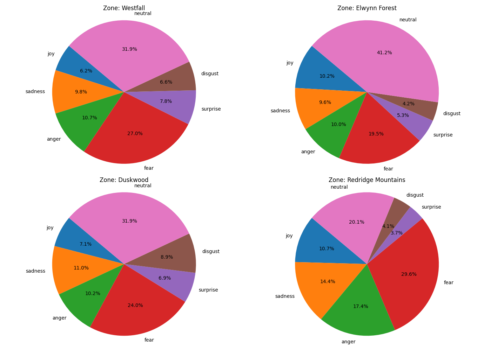
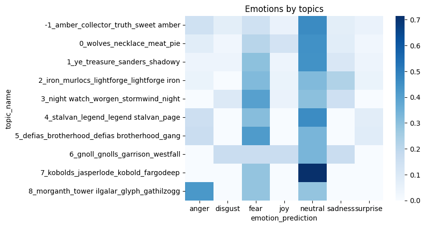
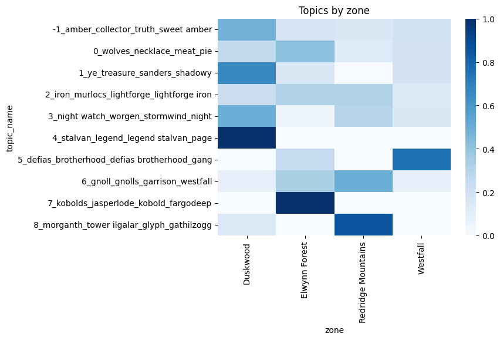

# Mini project: Thematic analysis of human zones in _World of Warcraft - Classic_

## Introduction
Blizzard Entertainment's successful massive multi online role-playing game (MMORPG) takes place in the fantasy world of Azeroth, divided into zones. Each zone is characterized by a number of imminent threats and problems.

The game is played by venturing through zones and taking on _quests_ from non-player characters, which request the player's aid.

This project digs into four human zones that are tightly connected geographically and politically and which have individual and common threats.
- Elwynn Forest: Kobolds overtaking mines, Defias and Gnoll presence
- Westfall: Defias bandits overtaking farms and the Moonbrook village
- Redridge Mountains: Blackrock orcs, Shadowhide gnolls
- Duskwood: Undead controlled by Morbent Fel, Worgens and dark riders

Research question: Using quests texts from the zones, what topical and emotional themes appear within and across zones?

## Data
The data was obtained by scraping [wowhead.com/classic](https://www.wowhead.com/classic) for quest IDs, zone, title, text and level. In total, 199 quests were collected. Below is an example of a scraped quest from the Westfall zone.

> ### The People's Militia
> Some Defias have eluded us. My most trusted scout reports that these Defias have been looting and pillaging the countryside, all the way into Southern Westfall. We believe they are hiding out in the Dagger Hills, plotting their next move. Slay the wretches in the name of The People's Militia.

## Methods
To analyze the data, I used emotion analysis and topic analysis.

Emotion analysis provides an emotional profile for quests and, by extension, zones. To get such an emotional profile, I used a HuggingFace transformer fine-tuned for emotion detection. The output of the model is a prediction or probability distribution over Ekman's six basic emotions (joy, anger, fear, disgust, surprise, sadness) and neutral.

To provide a macro-view of the contents and themes (besides emotional) in the quests by zone, I used BERTopic [^2] to cluster documents and provide interpretable topics.

## Analysis
The figure below shows the emotional profile of the four zones.

While neutral is dominant, it is striking how fear, anger and sadness are characteristic of the zones. Considering that quest-givers are civilians facing the effects of threatening factions or military/militia that seek to oppose them, fear and frustration are not surprising. Elwynn Forest is the most peaceful zone. Some quest text are also tied with success and looking ahead, which may explain joy.

To provide further insights, the plot below shows emotion distribution by topics.

The nature of the topics require some knowledge of the stories that play out. Below are two examples:
- Topic 3 (disgust, fear and sadness) revolves around the Night Watch of eerie Duskwood, a militia of civilians that seek to defend their home against undead and werewolves because they have been abandoned by the army of Stormwind.
- Topic 5 (anger, fear and surprise) revolves around the Defias Brotherhood, a gang of thieves and cutthroats that have recently shown themselves in Westfall and kicked out residents from their homes and are now spreading to Elwynn.

Finally, the plot below shows how the topics spread across zones, thereby tying stories together.

## Discussion
Stories are told through interactive gameplay and quest descriptions. Neither can stand alone, but the analysis above shows clearly how the text material binds together stories within and across zones. Furthermore, with emotional profiles of quests by zone and topics, it becomes clear how the quests aid in creating the atmosphere of the game and the stories in it, namely ones of fear and frustration. 

## References

[^1] Hartmann, J. (2022). Emotion English DistilRoBERTa-base. https://huggingface.co/j-hartmann/emotion-english-distilroberta-base/.

[^2] Grootendorst, M.R. (2022). BERTopic: Neural topic modeling with a class-based TF-IDF procedure. ArXiv, abs/2203.05794.
